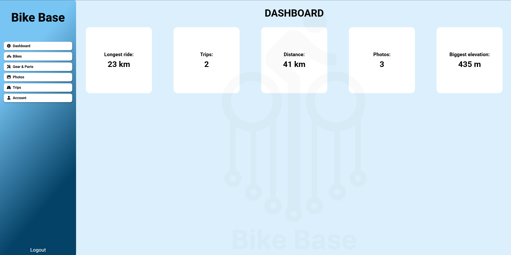
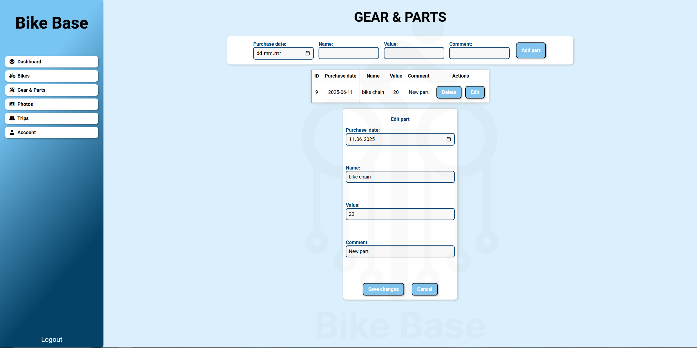

# Bike Base – Aplikacja do zarządzania rowerami i nie tylko!

Bike Base to nowoczesna aplikacja webowa umożliwiająca użytkownikom miejsce do łatwego i wygodnego przechowywania danych o swoich rowerach i osiągnięciach. Główne funkcjonalności aplikacji dostępne dla użytkowników:
- rejestracja oraz logowanie - dane użytkowników zabezpieczone są hasłem, które jest dodatkowo hashowane, aby zapewnić możliwie najlepszą ochronę,
- strona główna aplikacji - jest to miejsce, w którym zebrane są wszystkie największe osiągnięcia użytkownika,
- zarządzanie kolekcją rowerów - każdy użytkownik może dodać swoje rowery do aplikacji, aby stworzyć swoją własną galerię,
- lista zakupionego sprzętu oraz części rowerowych - informacje zebrane zostały w jednej tabeli co ułatwia przeglądanie,
- galeria zdjęć - za pomocą zwykłego przeciągnięcia zdjęcia użytkowników trafiają do bazy danych, gdzie są bezpiecznie przechowywane,
- lista odbytych treningów / wycieczek - użytkownicy mają możliwość dodawać i modyfikować informacje o swojej aktywności fizycznej.

## Interfejs użytkownika
Strony startowe zawierają formularze logowania oraz rejestracji. Podczas rejestracji użytkownik proszony jest o podanie swojego imienia, nazwiska, adresu email oraz podanie hasła. Po wypełnieniu formularza rejestracji użytkownik zostaje przeniesiony do formularza logowania, gdzie powinien podać poprawny email oraz hasło. W razie trzykrotnego podania niepoprawnych danych konto użytkownika zostaje zablokowane na minutę.
Interfejs jest responsywny i intuicyjny, działa zarówno na urządzeniach mobilnych jak i na stacjonarnych.

Po zalogowaniu użytkownik uzyskuje dostęp do aplikacji i zostaje przeniesiony do panelu głównego. Nawigacja odbywa się poprzez panel nawigacyjny znajdujący się po lewej stronie. W mobilnej wersji aplikacji pasek nawigacyjny znika, a zamiast niego pojawia się przycisk "hamburger menu". Po jego naciśnięciu, pasek nawigacyjny wyświetli się ponownie.

W mobilnej wersji kafelki z informacjami zostają dopasowane do szerokości ekranu.

W widoku "BIKES" możliwe jest przeglądanie posiadanych rowerów. 

A po kliknięciu przycisku "Add bike" również dodanie nowego roweru.

W kolejnej zakładce użytkownik może dodawać, edytować i usuwać posiadane części i sprzęt rowerowy.

Następna zakładka to galeria. Każdy użytkownik może dodawać i usuwać zdjęcia, które trafiają do bazy danych.

Zakładka "TRIPS" umożliwia zapisywanie, edycję i usuwanie wycieczek.

## System logowania i ról
System obsługuje różne role użytkowników:
- **User** – zwykły użytkownik mogący korzystać z systemu po zalogowaniu,
- **Admin** – administrator z pełnym dostępem do aplikacji. Poza podstawowym dostępem może on, zarządzać kontami użytkowników usuwając dowolne z nich.

Hasła przechowywane są w formie hashy, a dostęp do zasobów kontrolowany jest przez sesję.

Wygląd zakładki "ACCOUNT" różni się w zależności od roli, którą posiada użytkownik.

Wygląd dla użytkownika z rolą "user".

Wygląd dla użytkownika z rolą "admin".

## Architektura i wzorce projektowe
Projekt opiera się na:
- Architekturze MVC – rozdzielenie logiki biznesowej, prezentacji i danych,
- Zasadach SOLID – każda klasa ma jedną odpowiedzialność,
- Wzorcu Singleton – odpowiada za zarządzanie połączeniem z bazą danych.

## Wykorzystane technologie
- Backend: PHP 8+
- Frontend: HTML, CSS, JavaScript
- Baza danych: PostgreSQL
- Serwer: Nginx + PHP-FPM

Ponadto, aby móc wygodnie sprawdzać i edytowac dane znajdujące się w bazie danych uruchomionej na porcie 5433:5432, używany jest pgAdmin uruchamiany na porcie 5050:80.  
Dane do logowania do bazy danych:  
DB_USERNAME=docker  
DB_PASSWORD=docker  
DB_HOST=db  
DB_DATABASE=db